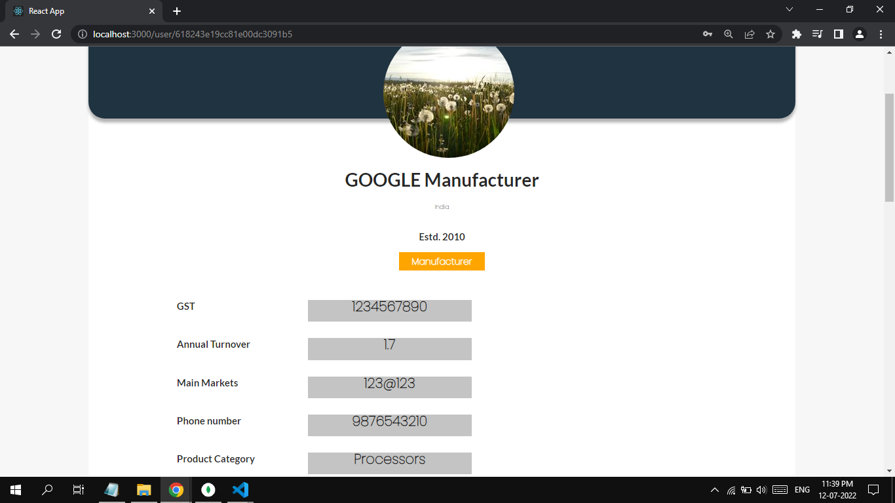
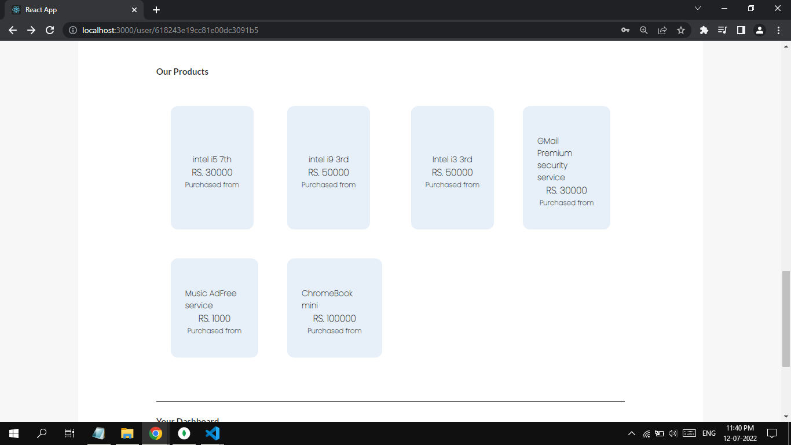
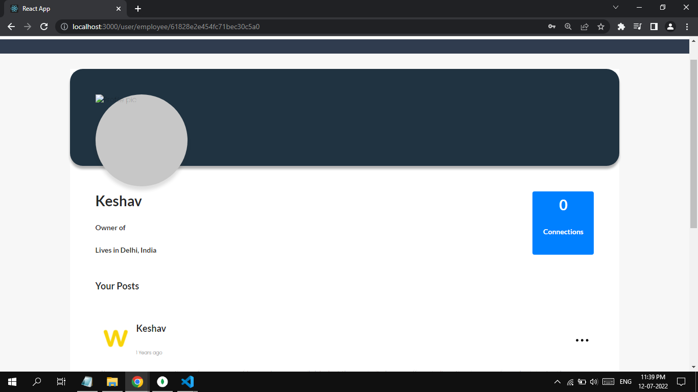
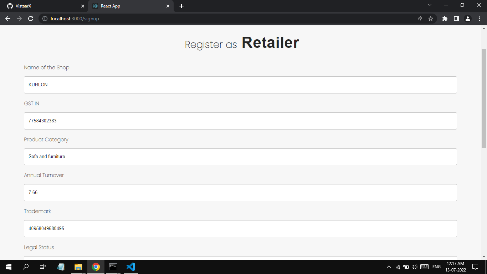

# VistaarX

A Full fledged Independent Platform for all of its kind ! 👨‍💼👩‍💼🚀

##
* Product sale and retails.
* Blog writing and connections.
* Sales and distributions.
* Collaborations in businesses.
* Network expansions and growth.
* Many more...

This project was bootstrapped with [Create React App](https://github.com/facebook/create-react-app).

## Have a look!

## Available Scripts

In the project directory, you can run:

### `yarn start`

Runs the app in the development mode.\
Open [http://localhost:3000](http://localhost:3000) to view it in the browser.

The page will reload if you make edits.\
You will also see any lint errors in the console.
